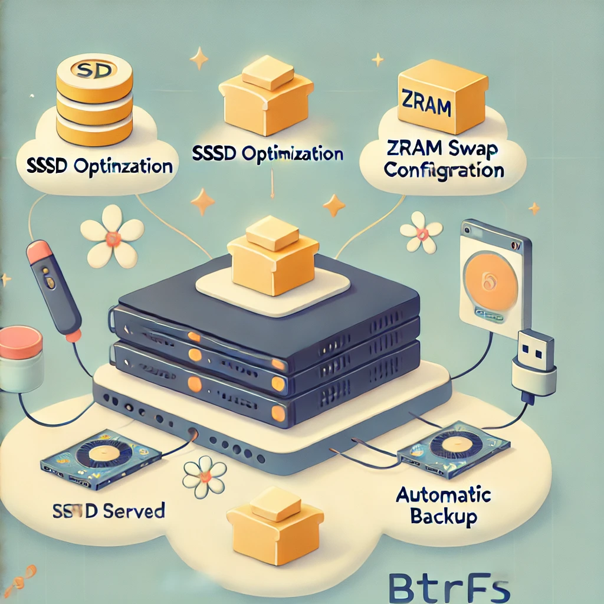

# butter-t0aster

> *a double-sided script to run right after first system boot, to mount subvolumes in a Debian BTRFS system, set up snapshots and automatic backups, in a scoop of buttery smoothness*

   



## why **_butter-t0aster_** ?

Because like butter in a toaster, butter-filesystem in your drive makes homelab management smooth, efficient, and deliciously simple.

## features

- **BTRFS subvolumes** for root (`/`) and home (`/home`) partitions
- **ZRAM** (because swap in RAM is faster and c00ler)
- **_mount options_** for **SSDs** longevity (`noatime, compress=zstd,ssd`) and TRIM on disk once a week
- **snapshot** of the filesystem immediately after the installation, so you can always roll back
- **automatic backup** of `/home` directory
- **keep the system alive** even when the laptop lid is closed
- **disable sleep/hibernation** (because, well, it's a server, not a napper)

## what you'll get

🧈 /root + /home on BTRFS subvols
📸 Snapshots ready to roll back
🛟 Auto-backups on USB plug-in
💨 ZRAM + SSD tweaks for speed

---

## prerequisites

- a freshly installed **Debian (11 or above)** server
- *msdos* or *gpt* partition table (old BIOS/no EFI computers use msdos/MasterBootRecord and do not require a specific `/boot` partition)
- two btrfs primary partitions with `noatime` mount options
  - `/` (bootable)
  - `/home`
- one swap area of 2GB should suffice (just in case)
- **sudo** privileges to execute the script (install sudo with root user and add sudo user)
- **USB device** labeled "_backups_" for automatic backups
- a copy of this script or an Internet connection

---

## why two scripts?
`butter.sh` sets up Btrfs and reboots to lock it in. Then `t0aster.sh` finishes the job—snapshots, backups, and a system check. Smooth as butter, twice as nice!

---

## installation simple steps

Once the Debian installation is finished and the server has rebooted, log in with the `sudo` user account (we do not recommend using root account - and we advise to never install funny scripts like this one with the root superuser) and run `cd` to reach the `/home` directory.

1. **download the scripts** to the sudo user `home` directory
   ```sh
   cd && wget https://raw.githubusercontent.com/lerez0/butter-t0aster/main/butter.sh && wget https://raw.githubusercontent.com/lerez0/butter-t0aster/main/t0aster.sh
   ```

2. **run the scripts from your sudo user home folder**
   ```sh
   sudo bash butter.sh  # mounts BTRFS subvolumes and reboots
   # after reboot:
   sudo bash t0aster.sh  # configures snapshots and backup, ZRAM and SSD
   ```

   This will automatically configure your system, apply all the optimisations, and reboot the server.

   🔥 oops!? If anything glitches, peek at /var/log/butter-t0aster.log for clues!

We'd be glad to read your experience - please return your comments in the 'Issues' section."

---

## MIY - make it your-own

Feel free to fork and edit the script to suit your needs! Want to change the snapshot frequency? Adjust the swappiness value? Or maybe add another backup target? All of that can be done by editing the `butter.sh` and `t0aster.sh` files.

---

## license

This project is under the MIT License. See the [LICENSE](LICENSE) file for details.

---

## contributing

If you have suggestions or improvements for the script, feel free to open an issue and send us love.

---

### **enjoy our buttery smooth server setup! 🧈🍞**

To take it a step further, we recommend running our Debian `firstb00t` script, to level up your server security to NSA's recommendations — because a smooth server deserves a tough shell!

Grab it at [firstb00t repo](https://github.com/lerez0/firstb00t). Expect a quick spread of safety: tighter SSH, sneaky firewall rules, email sender, spinning containers, and a log to peek at (`/var/log/firstb00t.log`). Your server’ll be slick *and* secure — ready to toast any troublemaker!

We'd like to thank [JustAGuy Linux](https://www.youtube.com/@JustAGuyLinux) and [Stephen's Tech Talks](https://www.youtube.com/@stephenstechtalks5377) for their inspiration

<p align="center"><b>made with ⏳ by le rez0.net</b></p>
